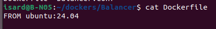
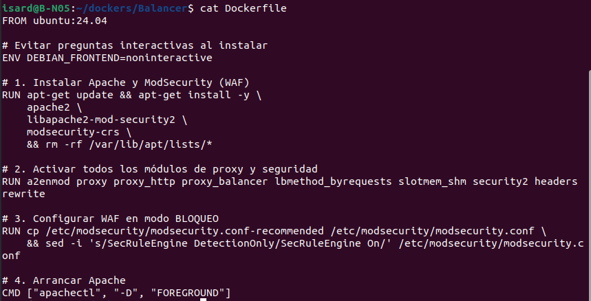
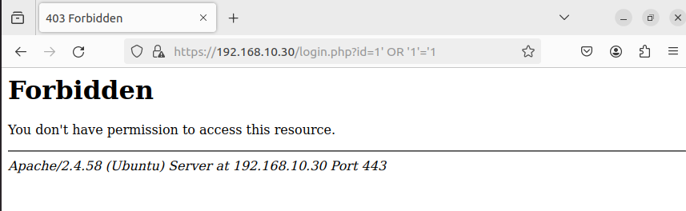
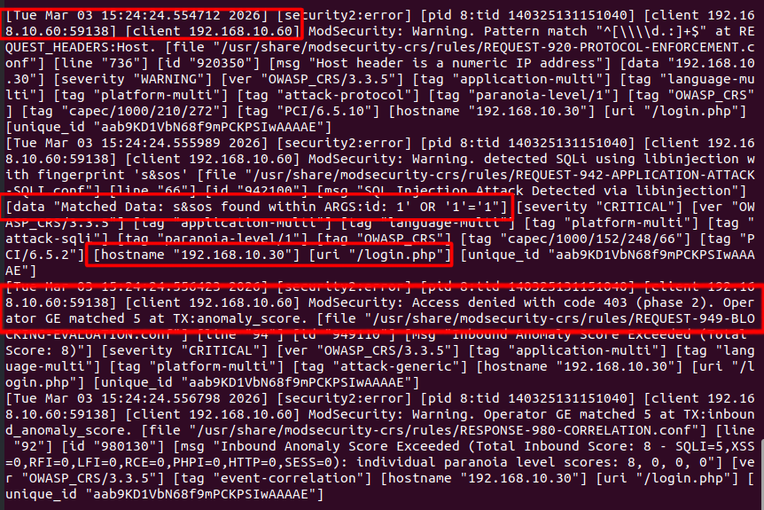

# 🛡️ Implementación de WAF ModSecurity - Sprint 4 (Seguridad)

En este documento se detallan los pasos técnicos seguidos para proteger la infraestructura de la aplicación **Extagram** mediante la implementación de un cortafuegos de aplicaciones web (WAF) en el nodo de balanceo (S1).

## 1. Cambio de Imagen Base de S1
Para una implementación robusta del WAF, hemos migrado el contenedor **s1-proxy** de la imagen oficial de Apache (`httpd:2.4`) a **Ubuntu 24.04**.

* **Motivo**: Facilitar la instalación e integración nativa del módulo de seguridad y las reglas OWASP mediante el gestor de paquetes `apt`.

## 2. Configuración del Dockerfile
Se ha creado un nuevo `Dockerfile` para el Balancer que realiza las siguientes acciones:
* Instalación de Apache2, `libapache2-mod-security2` y el conjunto de reglas base `modsecurity-crs`.
* Activación de los módulos de proxy (`proxy`, `proxy_http`, `proxy_balancer`) y el módulo de seguridad (`security2`).
* Configuración del motor de ModSecurity en modo **bloqueo** (`SecRuleEngine On`).

## 3. Definición del VirtualHost y Balanceo
Se ha refactorizado el archivo `balancer.conf` para adaptarlo a la estructura de directorios de Ubuntu (`/etc/apache2/sites-available/`):
* Se ha corregido el clúster de balanceo para apuntar a los nombres de contenedor correctos (`s2-app` y `s3-app`).
* Se ha establecido un orden de prioridades en las directivas `ProxyPass` para evitar conflictos entre contenido estático (`/uploads/`, `/static/`) y el contenido dinámico de la aplicación.

## 4. Ajustes en el Docker Compose
Se ha actualizado el archivo `docker-compose.yml` para reflejar el cambio de ruta de configuración en el contenedor S1:
* **Nueva ruta**: `./Balancer/balancer.conf:/etc/apache2/sites-available/000-default.conf`.

## 5. Pruebas de Funcionamiento y Evidencias
Para verificar la seguridad, se han realizado ataques simulados desde el navegador:

### Prueba de Inyección SQL (SQLi)
* **URL**: `http://192.168.10.30/login.php?id=1' OR '1'='1`
* **Resultado**: El WAF ha interceptado la petición y ha devuelto un código de error **403 Forbidden**.

### Logs de Seguridad
Se ha verificado la traza del ataque en los logs internos del contenedor (`/var/log/apache2/error.log`), donde se confirma la detección del patrón malicioso:
`ModSecurity: Access denied with code 403. Pattern [SQL Injection Attack Detected via libinjection] matched.`

