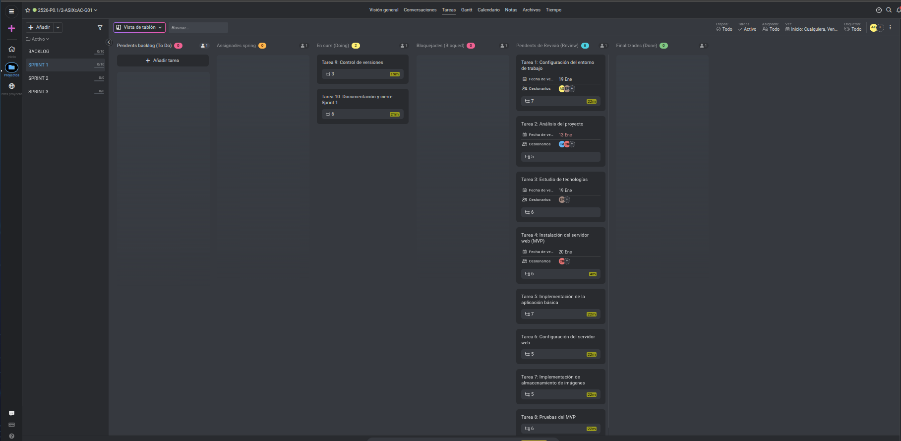

#  Acta de Revisión: Sprint 1
### Estructura Atómica y Despliegue Inicial

---

## Detalles de la Sesión
| **Fecha** | **Sprint** | **Proyecto** | **Estado** |
| :--- | :---: | :--- | :---: |
| 19/01/2026 | #1 | Despliegue Extagram |  Completado |

---

##  Equipo y Roles Asignados
Durante este sprint, la distribución de responsabilidades ha sido la siguiente:

| Área de Responsabilidad | Miembros del Equipo |
| :--- | :--- |
| ** Configuración de Entorno** | Eduard y Adriano Calderón |
| ** Análisis de Proyecto** | Carlos y Francesc |
| ** Estudios de Tecnología** | Eduard |

---

##  Hitos Alcanzados (Definition of Done)
Se han completado satisfactoriamente los siguientes objetivos marcados para la estructura atómica:

*  **Despliegue de Servicio:** Configuración funcional del servicio web en una estructura atómica (Monolito: Apache + PHP + MySQL).
*  **Documentación Inicial:** Creación y estructuración del repositorio en GitHub con la documentación técnica básica.
*  **Seguridad:** Implementación de buenas prácticas (externalización de credenciales).

###  Evidencia de Gestión

*> Estado de las tareas en la herramienta de gestión.*

---

##  Retrospectiva del Equipo
Análisis del funcionamiento interno durante el Sprint 1:

###  Lo que ha funcionado bien
* **Trabajo en Equipo:** La sinergia general del grupo ha sido satisfactoria.
* **Eficiencia:** La distribución de tareas por roles especializados ha permitido avanzar rápido en el despliegue técnico.

###  Áreas de mejora
* **Comunicación Interna:** Se han detectado momentos de desconexión. Es necesario establecer canales más fluidos o dailies más efectivas para el siguiente sprint.

---

##  Planificación Próximo Sprint (Sprint 2)
Objetivos preliminares para la fase de Microservicios:

1.  **Finalizar Documentación:** Detallar técnicamente los pasos realizados en el Sprint 1.
2.  **Arquitectura de Contenedores:** Iniciar la fragmentación del servicio monolítico.
    * Implementación de **Docker & Docker Compose**.
    * Segregación de servicios (Web, BBDD, Balanceador).

---