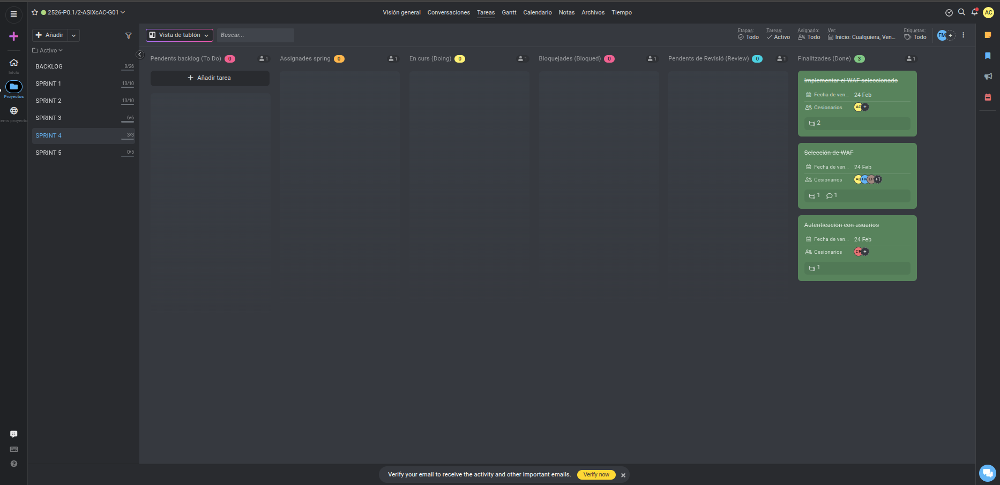

# Acta de Sprint 4 Planning | 17-02-2026

## Resumen de la Reunión

Tras finalizar exitosamente el proyecto P0.1 (Desplegament d'aplicació Extagram), el equipo se reúne para iniciar el **P0.2 - Securització i monitoratge d'infraestructura Extagram**.

El Sprint 4 se centrará en la implementación de medidas de seguridad para proteger la infraestructura desplegada.

---

## Objetivos de la Sesión

Durante la planificación se definieron los siguientes objetivos clave:
1. **Análisis de vulnerabilidades:** Identificar puntos débiles en la infraestructura actual.
2. **Implementación de firewall:** Proteger el punto de entrada (S1).
3. **Hardening de componentes:** Endurecer la seguridad de servidores web, sistema operativo y base de datos.
4. **WAF (Web Application Firewall):** Proteger contra ataques web comunes.

---

## Participantes y Roles

- **Scrum Master:** Carlos Rodríguez Díaz
- **Product Owner:** Francesc Martínez Ridao
- **Scrum Team:**
  - Eduard Pérez Ortuño
  - Adriano Calderón Paolino

---

## Contexto del Proyecto P0.2

### Estado Actual (P0.1 Completado)

Infraestructura desplegada:
- 7 contenedores Docker operativos (S1-S7)
- Alta disponibilidad implementada (S2, S3)
- Volúmenes persistentes configurados
- Aplicación Extagram funcional

### Problemas Identificados

**Vulnerabilidades de seguridad:**
- Puertos expuestos sin restricciones
- Sin protección contra ataques web (SQL Injection, XSS)
- Configuraciones por defecto de Apache y MySQL
- Ausencia de logs de seguridad centralizados
- Sin limitación de rate limiting

---

## Objetivos del Sprint 4

### 1. Implementación de Firewall

**Objetivo:** Proteger el acceso al Load Balancer (S1) filtrando tráfico malicioso.

**Tareas:**
- Configurar iptables o UFW delante de S1
- Bloquear todos los puertos excepto 80 (HTTP) y 443 (HTTPS)
- Implementar rate limiting para prevenir ataques DDoS
- Configurar reglas para limitar conexiones simultáneas
- Documentar reglas del firewall

**Criterios de aceptación:**
- Solo puertos 80 y 443 accesibles desde el exterior
- Máximo 100 peticiones por minuto por IP
- Logs de conexiones bloqueadas activos

---

### 2. Hardening de Servidores Web (S1, S2, S3, S4, S5, S6)

**Objetivo:** Endurecer la configuración de Apache en todos los servidores web.

**Tareas:**
- Deshabilitar firma del servidor (ServerTokens, ServerSignature)
- Implementar cabeceras de seguridad HTTP:
  - X-Content-Type-Options
  - X-Frame-Options
  - X-XSS-Protection
  - Strict-Transport-Security (HSTS)
  - Content-Security-Policy (CSP)
- Deshabilitar métodos HTTP innecesarios (TRACE, DELETE, PUT)
- Configurar timeout de sesiones
- Limitar tamaño de peticiones
- Deshabilitar listado de directorios
- Configurar permisos restrictivos en archivos

**Criterios de aceptación:**
- Apache no revela versión ni información del sistema
- Cabeceras de seguridad presentes en todas las respuestas HTTP
- Solo métodos GET, POST y HEAD permitidos
- Sin listado de directorios activo

---

### 3. WAF (Web Application Firewall)

**Objetivo:** Proteger contra ataques web comunes mediante ModSecurity.

**Tareas:**
- Instalar y configurar ModSecurity en S1
- Implementar OWASP Core Rule Set (CRS)
- Configurar reglas contra:
  - SQL Injection
  - Cross-Site Scripting (XSS)
  - Command Injection
  - Path Traversal
  - File Upload malicioso
- Configurar modo de detección inicialmente
- Pasar a modo de bloqueo tras validación
- Documentar reglas activadas

**Criterios de aceptación:**
- ModSecurity operativo en modo bloqueo
- OWASP CRS implementado
- Logs de ataques bloqueados activos
- Pruebas de penetración básicas superadas

---

### 4. Hardening del Sistema Operativo

**Objetivo:** Asegurar el sistema operativo base de los contenedores.

**Tareas:**
- Actualizar todos los paquetes a las últimas versiones
- Eliminar paquetes y servicios innecesarios
- Configurar permisos restrictivos:
  - Usuarios sin privilegios para procesos Apache
  - Directorio /uploads/ con permisos 755
  - Archivos PHP con permisos 644
- Deshabilitar acceso root directo
- Configurar sudo con restricciones
- Implementar fail2ban para bloquear IPs sospechosas

**Criterios de aceptación:**
- Apache ejecutándose con usuario www-data (sin privilegios)
- Sin servicios innecesarios activos
- Fail2ban configurado y activo
- Permisos de archivos verificados

---

### 5. Hardening de Base de Datos (S7)

**Objetivo:** Asegurar MariaDB contra accesos no autorizados.

**Tareas:**
- Ejecutar mysql_secure_installation
- Eliminar usuarios anónimos
- Deshabilitar acceso root remoto
- Eliminar base de datos de prueba
- Cambiar contraseñas por defecto
- Configurar permisos restrictivos para extagram_admin
- Habilitar logs de consultas sospechosas
- Limitar conexiones simultáneas
- Configurar bind-address solo a red interna Docker

**Criterios de aceptación:**
- Sin usuarios por defecto activos
- Root solo accesible desde localhost
- Usuario extagram_admin con permisos mínimos necesarios
- Logs de accesos configurados

---

### 6. Hardening Específico para S5 y S6

**S5 (Image Server):**
- Validar extensiones de archivo servidas (solo jpg, png, gif, webp)
- Implementar Content-Type estricto
- Configurar rate limiting específico para imágenes
- Cabeceras Cache-Control y Expires
- Bloquear acceso a archivos ocultos (.htaccess, .git)

**S6 (Static Server):**
- Validar tipos MIME (solo CSS y SVG)
- Implementar CSP estricta
- Configurar SRI (Subresource Integrity) si es posible
- Bloquear ejecución de scripts
- Rate limiting para archivos estáticos

**Criterios de aceptación:**
- S5 solo sirve archivos de imagen válidos
- S6 solo sirve CSS y SVG
- Cabeceras de seguridad específicas implementadas
- Logs de intentos de acceso no autorizado

---

## Distribución de Tareas

| Tarea | Responsables | Estimación |
|-------|--------------|------------|
| Implementación de Firewall | Carlos | 3h |
| Hardening Apache (S1, S2, S3, S4) | Carlos y Francesc | 3h |
| Hardening Apache (S5, S6) | Eduard | 2h |
| WAF (ModSecurity) | Francesc | 3h |
| Hardening Sistema Operativo | Adriano | 2h |
| Hardening Base de Datos | Adriano | 2h |
| Pruebas de Seguridad | Todo el equipo | 2h |
| Documentación | Todo el equipo | 3h |

**Total estimado:** 20h (se ajustará durante el sprint)

---

## Metodología de Trabajo

### Enfoque
- **Trabajo por componentes:** Cada miembro se especializa en componentes específicos
- **Revisión cruzada:** Validación de configuraciones de seguridad entre miembros
- **Pruebas continuas:** Validar cada cambio antes de pasar al siguiente
- **Documentación paralela:** Documentar mientras se implementa

### Dailies
- Sincronización diaria a las 15:10
- Duración máxima: 15 minutos
- Formato: Qué hice ayer / Qué haré hoy / Impedimentos

### Herramientas de Pruebas
- **Nikto:** Escaneo de vulnerabilidades web
- **OWASP ZAP:** Pruebas de penetración
- **sqlmap:** Pruebas de SQL Injection
- **curl:** Validación de cabeceras HTTP

---

## Definition of Done

El Sprint 4 se considerará completado cuando:

- [ ] Firewall configurado y operativo delante de S1
- [ ] Hardening de Apache completado en todos los servidores
- [ ] WAF (ModSecurity) activo y bloqueando ataques
- [ ] Sistema operativo endurecido en todos los contenidores
- [ ] Base de datos asegurada según mejores prácticas
- [ ] S5 y S6 con configuraciones de seguridad específicas
- [ ] Pruebas de seguridad básicas superadas
- [ ] Documentación técnica completa
- [ ] Acta de Sprint Planning completada
- [ ] Acta de Sprint Review preparada

---

## Riesgos Identificados

| Riesgo | Probabilidad | Impacto | Mitigación |
|--------|--------------|---------|------------|
| Configuración de WAF rompe funcionalidad | Media | Alto | Empezar en modo detección, probar antes de bloquear |
| Firewall bloquea tráfico legítimo | Media | Alto | Probar reglas en entorno de desarrollo primero |
| Hardening de BD rompe conexiones | Baja | Alto | Backup de configuración antes de cambios |
| Tiempo insuficiente | Media | Medio | Priorizar tareas críticas primero |

---

## Métricas a Medir

- Número de reglas de firewall implementadas
- Cantidad de cabeceras de seguridad HTTP añadidas
- Ataques bloqueados por WAF (durante pruebas)
- Puertos cerrados vs. iniciales
- Tiempo de respuesta antes/después del hardening

---

## Entregables del Sprint 4

1. **Configuración de seguridad:**
   - Archivos de configuración de firewall
   - Configuraciones de Apache actualizadas
   - Reglas de ModSecurity
   - Scripts de hardening

2. **Documentación:**
   - Guía de configuración de seguridad
   - Documentación de cada medida implementada
   - Resultados de pruebas de seguridad
   - Troubleshooting de problemas comunes

3. **Evidencias:**
   - Capturas de ProofHub
   - Logs de ataques bloqueados
   - Resultados de escaneos de seguridad

---

## Próximos Pasos

**Fecha de inicio:** 17/02/2026  
**Fecha de finalización:** 24/02/2026  
**Sprint Review:** 24/02/2026  
**Siguiente Sprint (S5 - Monitoratge):** Inicio 02/03/2026

---

## Evidencia de Gestión

Estado inicial de las tareas del Sprint 4 en ProofHub.

---

## Notas Adicionales

- Mantener comunicación constante durante la implementación
- Realizar backups antes de cambios críticos
- Probar en entorno de desarrollo antes de producción
- Documentar cada cambio realizado
- Validar que la aplicación sigue funcionando después de cada cambio

---